# The Fork

* The Fork is a made up resturaunt based in a town in south of Sweden. This app is a booking system designed so that visitors and staff easily can manage the booking of tables. Both parties can book, view, change and delete their reservations as per their own liking. 

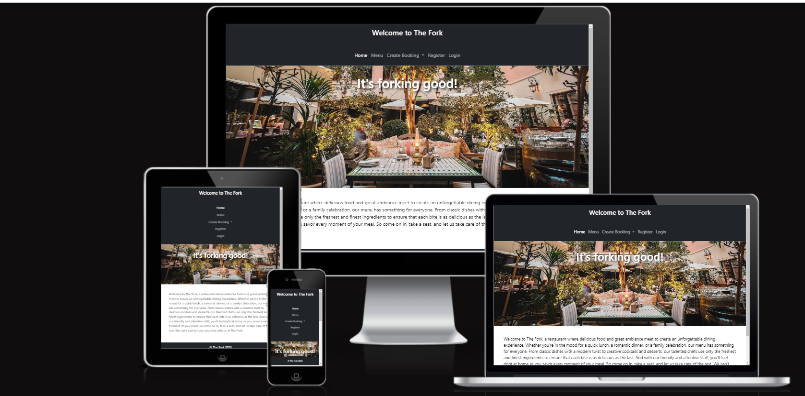

## Planning

* This project was developed through the Kanban board, you can find this via the github projects. Here the developer creates cards to help them during the development, this is mainly to make it easier to keep track of the different user stories and make sure everything is completed.

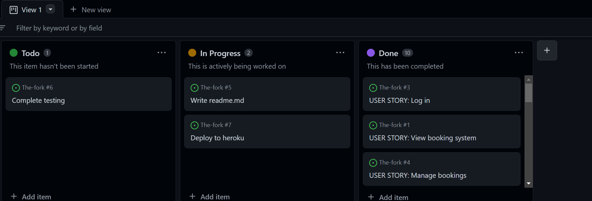

## User experience

### Site goals

* This site is created with the intention to help the resturaunt keep track of their bookings. They should be able to view and change if they think it should be neccessary

* It should also be capable to provide the visitors with the same type of functions, the only exception should be that they only can manage their own bookings. The site will provide a simple way of making a reservation.

### First time user goals
* As a first time user I want the navigation to be simple
* As a first time user I want the registration to be simple
* As a first time user I want the login to be simple
* As a first time user I want the logout to be simple
* As a first time user I want to easily understand the menu
* As a first time user I want to easily understand the booking system
* As a first time user I want to easily understand how to change/delete my reservations

## Site structure

### Navigation

* The navigation bar provides the different links for the different pages, such as Home, Menu, Create Booking/Manage Booking, register, login and logout. It is accesable on all pages and offers the user an easy experience.

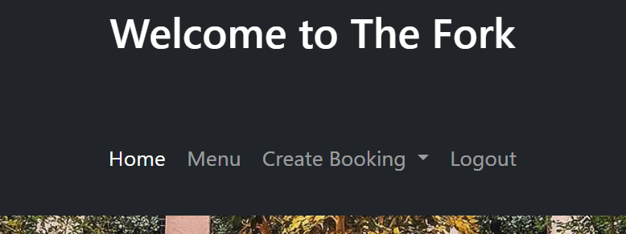

### Home page

* The Home page introduce the user to the resturaunt. An image of tables, glasses and nice lighting is shown and just beneath you can read a description of what the resturaunt try to achieve.

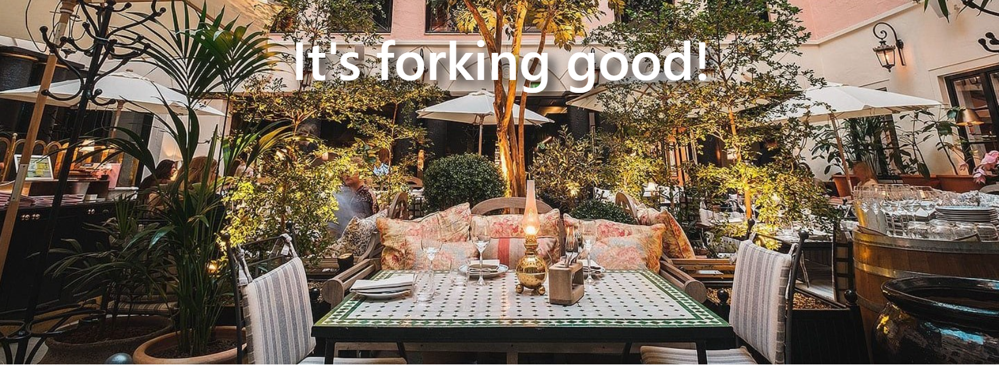
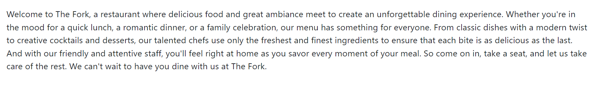

### Menu

* The menu-page also show an image and underneath you can see a simple, yet delicious, menu of different courses the user can choose from. 

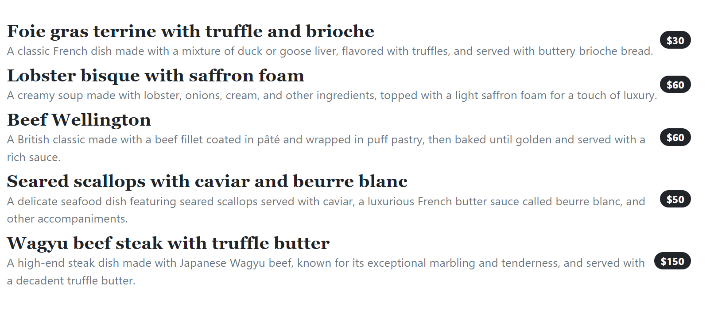

### Create/manage Booking

* Here the user can choose between the create booking page or the manage booking page.
* Create booking offers the user to easily pick when they want to make their reservation. They can choose date and time, and they have to fill in their name, email and how many guests that will attend to book. They will not be able to book at the same time as someone else, if that happens a message looking like this will appear:

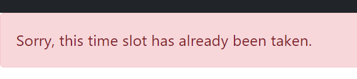

* If the user then click on the manage booking option they can see their reservation and they are able to edit and delete as per their liking. If the user click on 'delete' they can see a sign popping up asking if they are sure, the user then have to press yes or no.

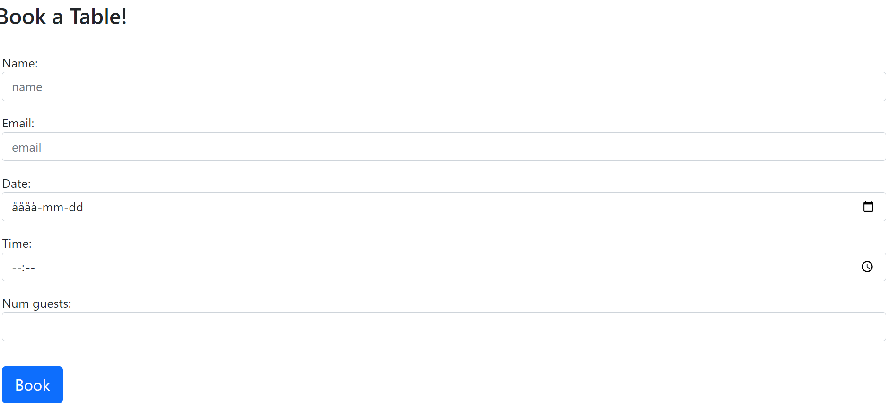
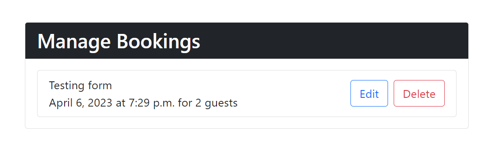

### Register

* Makes it available for a new user to create an account, you have to have an account to be able to book a reservation.

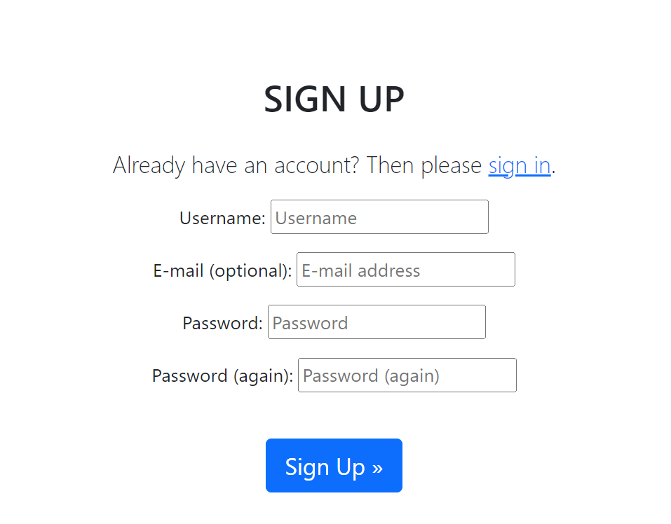

### Login

* This page is where the user can log in and then redirect themselves to the create booking page if they want. 

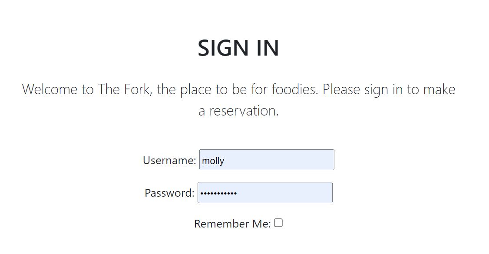

### Logout

* This page is where the user can log out if they want.

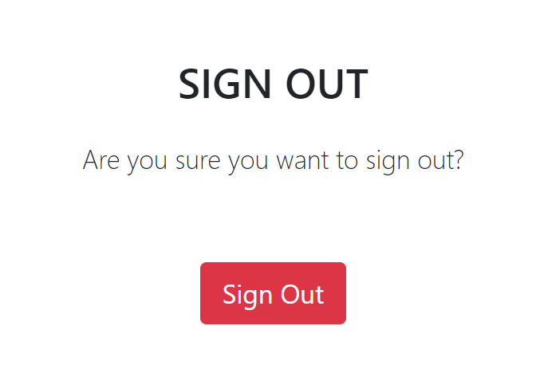

### Footer

* Is at the bottom of the page, showing copyright statment and year.

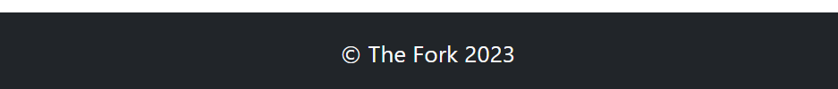

### Favicon

* To make it easier for the user so they know which tab to click if they have several open. This is added to bring a more professional and put-together look.  

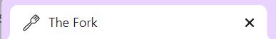

### Features left to implement

* I would like to add a map function to point out where the location is
* I would like to add a function to the menu so that the users
 can choose what they want and add to their booking
* I would like to spend some more time on the styling and make sure it looks even classier
* I would like to clean up the time slots so that the user can have a simpler choosing. I want to apply a 15 min interval.

## Design

### Wireframes 

* I created different Wireframes via the Balsamiq website, I used this because I wanted to structure everything up for myself to make it easier for me to create.

* This is the design for the home page:

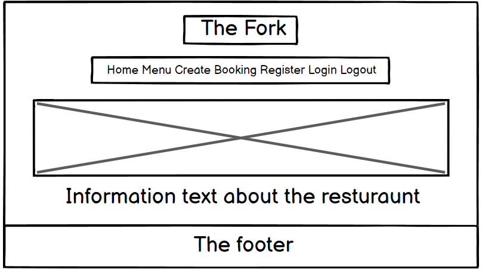

* This is the design for the menu page:

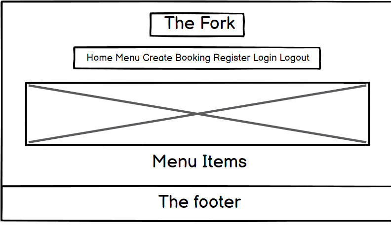

* This is the design for the create booking page:

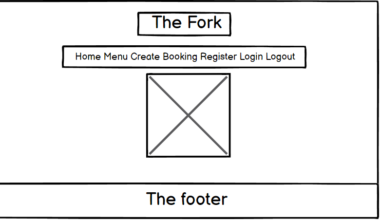

* This is the design for the manage booking page:

* This is the design for the register page:

* This is the design for the login page:

* This is the design for the logout page:

### Images

* images used n the project were all found on pexels

### Color-scheme

* I decided to keep it clean and minimalistic to get a classy and calm feel. The black and white color-combos was applied to offer the user the sense of professionalism. 

## Admin Page
* Admin has access via the default Django Admin page. The Admin login can be accessed from the navigation menus once a superuser has logged into The Fork. Once logged in, Admin users have all the access to create, edit and delete all bookings. All the requests can be viewed from the admin page.

## Technologies 

* [GitHub](https://github.com/) - to host the repositories.
* [Gitpod](https://www.gitpod.io/) - as the IDE for the application.
* [Python](https://docs.python.org/3/contents.html) - primary language of the application.
* [HTML](https://www.w3schools.com/html/) - Structure/skeleton of the page
* [CSS](https://www.w3schools.com/css/) - extra styling of the webpage
* [Javascript](https://www.w3schools.com/js/) - the apply some extra button functions that I wanted
* [Stack overflow](https://stackoverflow.com/) - basic explaining 
* [Bootstrap 5](https://www.w3schools.com/bootstrap5/bootstrap_get_started.php) - for design and placement
* [PEP8](http://pep8online.com/) - for testing and validating the code.
* [Google Fonts](https://fonts.google.com/about) - for the font of the text

## Python modules used

* Resturaunt Booking System

## Testing

### Lighthouse

* This is the read from lighthouse:

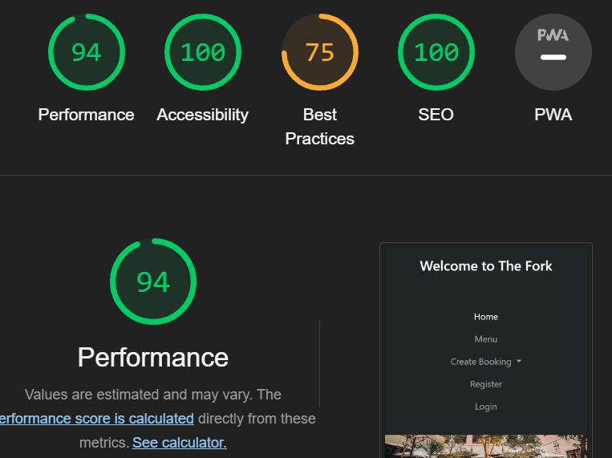

### Validator testing

* I tested it through the python validator and no errors or warnings were shown. Everything works perfectly, no errors were returned.
* The problems shown in the workspace were fixed as well. 
*  All the code has been run through the W3C html validator, the W3C CSS validator and the JavaScript JSHint validator. The code passed the W3C Validator barring all the django template tags. Outside of those, no errors were found.

* All code passed through the pep8-validator came out clean, looking like this:

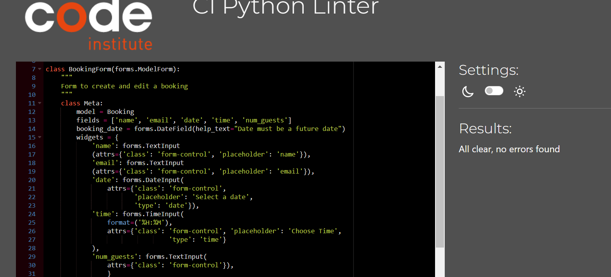

### Manual testing

* Only the admin/staff can access all of the bookings
* If the user try to book at the same time as someone else there is an errormessage shown
* It is not possible to book unless the user has an account
* The former bookings is not shown unless the the user has an account
* The user can only see their own bookings
* The user can only delete/edit their own bookings
* The admin/staff can delete/edit all bookings

### Bugs

* No bugs were detected

## Deployment

### [Github](https://github.com/) 

* When logging into github, navigate to the settings tab
* Here you can find pages down on the left side
* A new page will load which will present the branch to master or main, and then the save option
* Once the save button has been clicked and the page is reloaded there will be a link to the deployed site.

### [Heroku](https://www.heroku.com/) Deployment:

* Ensure your requirements.txt file has the required dependencies. To do this you can use the following
code in your IDE: pip3 freeze > requirements.txt
* Create or login to you Heroku account
* Navigate to Dashboard
* Click and select "Create app" in the middle of the page
* Enter a unique name for you app
* Select region and the "create app"

### App deployment
* Navgiate to the deploy section
* Scroll down to the "deployment method" and select "Github"
* Authorise the connection
* Search for the repository name you've chosen
* Make sure you have selected the correct branch (master/main), and select the method you desire.

## Credits 

### Content

* I used Code Institute's I Think Therefore I Blog (walkthrough project) for guidance with code structure and deployment steps. I found it really useful and helped me alot along the way.

### Acknowledgements
* This Resturaunt Booking System was created as Portfolio Project 4 for the the Full Stack Software Developer diploma by the [Code Institute](https://codeinstitute.net/). It was with great pleasure to explore the basics of most booking systems and to achieve some new skills.
* I would like to thank my mentor [Gareth McGirr](https://www.linkedin.com/in/gareth-mcgirr/) for helping me and guiding me through this project, the tutors at code institute for being extremely helpful considering my many questions and to my partner who helped me with mental support.

Molly Adamsson, 2023